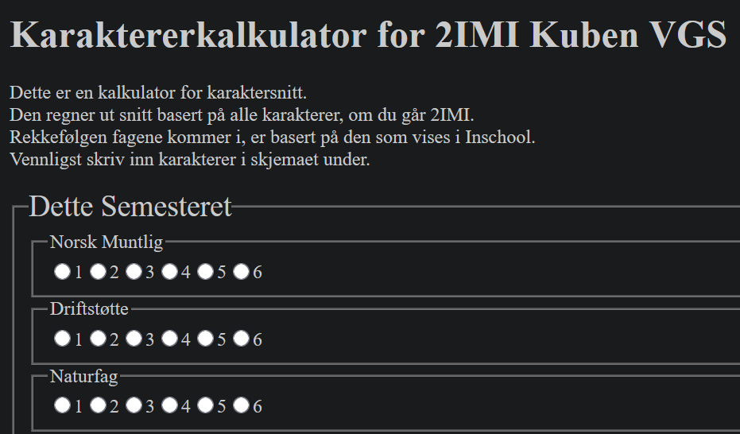

# Utvidelse av Karakterkalkulator

## Forord

Dette er en utvidelse av mitt tidligere karakterkalkulator-prosjekt. Prosjektet er laget/utvidet på grunnlag av faget Informasjonsteknologi 1 (IT1) hos Kuben videregående skole.

Hvis du vil se over det gamle prosjektet, finner du det på Github ved hjelp av lenken under. [https://github.com/sivertmh/hub-it1-prosjekter/tree/main/karaktersnitt](https://github.com/sivertmh/hub-it1-prosjekter/tree/main/karaktersnitt)

## Idéer til Forbedring

Jeg velger å fortsette med denne karakterkalkulatoren siden det mangler noen sentrale funksjoner i appen, i tillegg til noen andre som hadde vært nyttig.

### Bruker Kan Legge Til Karakterer

Den første av disse endringene i appen er å la brukeren kunne legge til nye karakterer til skjemaet. På denne måten blir kalkulatoren et mer universelt verktøy. Da kan f.eks. elever som ikke går 2IMI få bruk for applikasjonen.

### Sortere Fag

Gi bruker mulighet til å sortere fag basert på ulike faktorer, f.eks. alfabetisk.

## Gjennomføring

### Legge til Karakter

Først så la jeg til et ekstra fieldset i HTML. Så måtte jeg hente dette fieldset-et i JS og bruke min ekstisterende genForm-funksjon.

## Kilder

Du finner kildene i dokumentasjonsmappen, i en fil som heter [kildeliste.md](./dokumentasjon/kildeliste.md).
